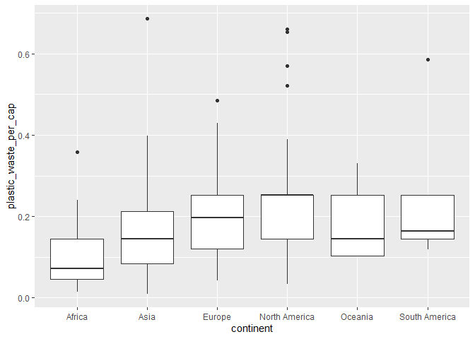
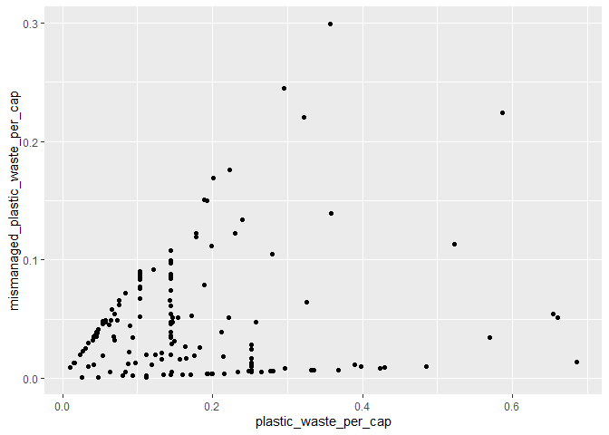
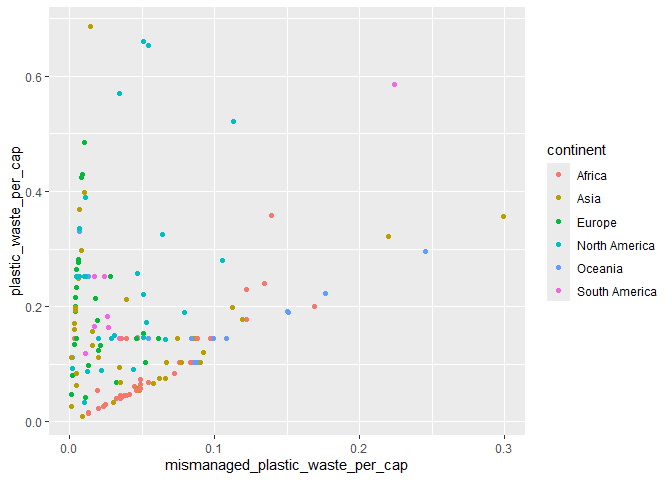
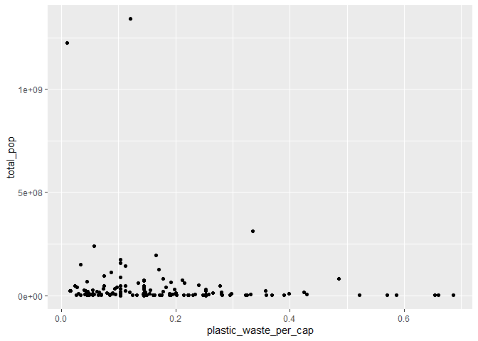
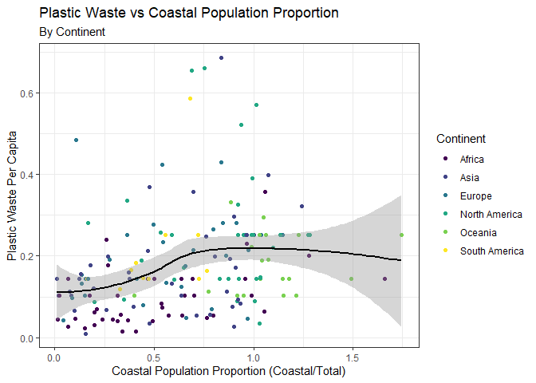

Lab 02 - Plastic waste
================
Hannah Crawley
1/22/2025

## Load packages and data

``` r
library(tidyverse) 
```

``` r
plastic_waste<- read.csv("data/plastic-waste.csv")
```

## Warmup

4 panes of RStudio include:  
1) source - where you write edit and save and R code  
2) console - can directly execute code here p.s. do not write here and
expect it to save  
3) environment (contains envi, history, connections)- displays current
projects  
4) output - displays outputs but also holds your file directory

How many entries are in the dataset? (use view(filename) to see or click
in envi pane)  
- 240 entries

### Exercise 1

``` r
ggplot(data = plastic_waste, aes(x = plastic_waste_per_cap)) +
  geom_histogram(binwidth = 0.2)
```

    ## Warning: Removed 51 rows containing non-finite outside the scale range
    ## (`stat_bin()`).

<!-- -->

Notice there is an extreme outlier on the right hand side of the graph.
To determine which country this is, filter the data for countries where
waste per capita is greater that 3.5kg/person

``` r
filter_plastic_waste<- plastic_waste%>%
  filter(plastic_waste_per_cap < 3)
```

1.1 Interpretation  
- Did not particularly expect this result - based on a quick google
search Trinidad and Tobago appears to have a waste problem due to a
variety of issues from high import volume, poor infrastructure, and
limited land for landfills. Generally, many of the countries hover
around 0.25 kg/person with a cluster falling below that and into the
negative.

``` r
ggplot(
  data = filter_plastic_waste,
  aes(x = plastic_waste_per_cap)
) +
  geom_density()
```

<!-- -->

``` r
ggplot(
  data = filter_plastic_waste,
  mapping = aes(
    x = plastic_waste_per_cap,
    color = continent
  )
) +
  geom_density()
```

<!-- -->

``` r
ggplot(
  data = filter_plastic_waste,
  mapping = aes(
    x = plastic_waste_per_cap,
    color = continent,
    fill = continent
  )
) +
  geom_density()
```

<!-- -->

``` r
ggplot(
  data = filter_plastic_waste,
  mapping = aes(
    x = plastic_waste_per_cap,
    color = continent,
    fill = continent
  )
) +
  geom_density(alpha = 0.7)
```

<!-- -->

### Exercise 2

2.1 Lower alpha

``` r
ggplot(
  data = filter_plastic_waste,
  mapping = aes(
    x = plastic_waste_per_cap,
    color = continent,
    fill = continent
  )
) +
  geom_density(alpha = 0.2)
```

<!-- -->

2.2 Why did we define color and fill of the curves via aesthetics but we
defined alpha as a characteristic?  
Mapping vs setting  
- Mapping is a characteristic that is based on values of a variable in
the data set (goes into aesthetics) - in our case color and fill are
based on continent  
- Settings of points are not based on values pertaining to variables in
the dataset (can go into geom\_\*) - in our case transparency is not
tied directly to the dataset, rather it is a tool for visualization
purposes

### Exercise 3

Another way to visualize - side-by-side box plots

``` r
ggplot(
  data = filter_plastic_waste,
  mapping = aes(
    x = continent,
    y = plastic_waste_per_cap
  )
) +
  geom_boxplot()
```

<!-- -->

``` r
ggplot(filter_plastic_waste, aes(x= continent, y= plastic_waste_per_cap)) + geom_violin()
```

<!-- -->

3.1 Violin plots vs boxplots  
- Violin plots better show the distribution of our data, specifically
the density. Whereas, boxplots better show summary statistics such as
the median, quartiles, and outliers.

### Exercise 4

``` r
ggplot(filter_plastic_waste, aes(y = mismanaged_plastic_waste_per_cap, x = plastic_waste_per_cap)) + geom_point()
```

<!-- -->

4.1 Describing relationship between plastic waste per capita and
mismanaged waste  
- The relationship between plastic waste and mismanged waste is positive
and linear

``` r
ggplot(filter_plastic_waste, aes(x = mismanaged_plastic_waste_per_cap, y = plastic_waste_per_cap, colour = continent)) + geom_point()
```

<!-- -->

4.2 Interpretation by continent  
- Countries in Europe tend to have the lowest plastic waste per capita
and the most well managed waste per capita.  
- One country in North America has poor waste management and a high
level of waste per capital. Otherwise, most coutntries in North America
are clustered.  
- Countries of Africa, Oceana, and South America appear to have the most
variable relationships. Patterning may be related to development of
country.

``` r
ggplot(filter_plastic_waste, aes(x = plastic_waste_per_cap, y = total_pop)) + geom_point()
```

    ## Warning: Removed 10 rows containing missing values or values outside the scale range
    ## (`geom_point()`).

<!-- -->

``` r
ggplot(filter_plastic_waste, aes(x = plastic_waste_per_cap, y = coastal_pop)) + geom_point()
```

<!-- -->

4.3 Linearity  
- Neither of these pairs of variables appear to be more strongly
linearly associated than the other. However, if I had to choose, I would
say that the coastal population plot is likely more linear due to an
higher number of outliers.

### Exercise

``` r
ggplot (filter_plastic_waste, aes(x = coastal_pop/total_pop, y = plastic_waste_per_cap, color = continent)) + theme_bw() + geom_point ()+ geom_smooth(color = 'black') + scale_color_viridis_d() + labs(title = "Plastic Waste vs Coastal Population Proportion", subtitle = "By Continent", x = "Coastal Population Proportion (Coastal/Total)", y = "Plastic Waste Per Capita", color = "Continent") 
```

    ## `geom_smooth()` using method = 'loess' and formula = 'y ~ x'

    ## Warning: Removed 10 rows containing non-finite outside the scale range
    ## (`stat_smooth()`).

    ## Warning: Removed 10 rows containing missing values or values outside the scale range
    ## (`geom_point()`).

<!-- -->
